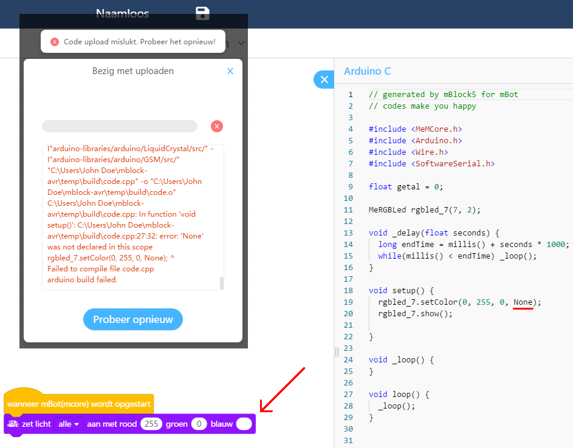
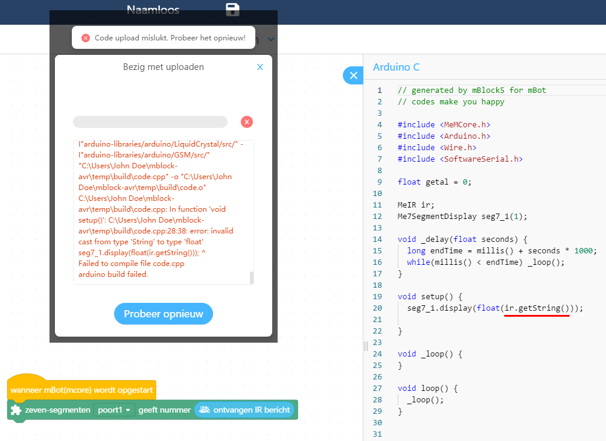

# mbot_parcival

## Planning les 3:

 * ['Werkt dit?' quiz](werkt_dit_quiz.md)
 * ['Werkt dit?' antwoorden](werkt_dit_antwoorden.md)
 * ['Communicatie' quiz](communicatie_quiz.md)
 * ['Communicatie' antwoorden](communicatie_antwoorden.md)

### Simpele communicatie


### Fouten in detail





## Planning les 2:

Tijd|Activiteit
---|---
18:00-18:45|Blok 1: variabelen, stoplicht
18:45-19:00|Pauze
19:00-19:45|Blok 2: functieblokken, lijn-volg robot
19:45-20:00|Pauze
20:00-20:45|Blok 3: communicatie
20:45-21:00|Pauze, uitloop

Detailplanning:

 * 18:00: Doel van de avond
   * Lesdoelen: 
     * Het eind laten zien van wat er met de blokken mogelijk is
     * Kunnen inschatten wanneer de ll moet leren wat een variabele is
     * Kunnen helpen als een ll het overzicht van een programma kwijt is
     * lln zeggen 'We hebben nu het meeste van mBot wel gesnapt'
   * Niet-lesdoelen: mechanica, lesideeen, tot 21:00 door
   * Docentdoel: lesdoel in een les bereiken
 * 18:15:
   * Opdracht: laat standaard LEDs blauw branden. Maak de LEDs rood als je op de knop drukt
   * Onmogelijke opdracht: laat de LEDs van kleur veranderen als je op de knop drukt
   * Oplossing: variabele
   * Woordweb: wat is een variabele?
   * Demo variabele
   * Verder met opdracht: laat de LEDs van kleur veranderen als je op de knop drukt
 * 18:45 pauze
 * 19:00
   * Demo lijnvolgrobot: aftellen, volgen, stoppen
   * Probleem: groot programma
   * Plenair: hoe om te gaan met grote programma's
   * Demo en waarom functieblokken
 * 19:45 pauze
 * 20:00
   * Demo panda en wiskunde: fibonacci
   * Demo communicatie: doorgeven
   * Demo communicatie: papier schaar steen

## Planning les 1:

Tijd|Activiteit
---|---
18:00-18:45|Blok 1: installeren mBlock :warning:
18:45-19:00|Pauze
19:00-19:45|Blok 2: on-board componenten programmeren
19:45-20:00|Pauze
20:00-20:45|Blok 3: externe componenten programmeren
20:45-21:00|Pauze, uitloop


Detailplanning:

 * 18:00: Doel van de avond
   * Lesdoel: lln zeggen 'We redden ons nu wel met het programmeren van de mBot'
   * Niet-lesdoelen: mechanica, lesideeen, tot 21:00 door
   * Docentdoel: lesdoel in een les bereiken
 * Voorkennis activeren: 'mBot is ...' in woordweb
 * Planning:
   * installeren :warning: 
     * :warning: admin rechten nodig
     * :warning: download is 500 Mb
     * :warning: het eerste venster duurt ongemakkelijk lang
     * :rainbow: geschatte tijd: 15 minuten (geen haast, geen kennis, WiFi, admin wachtwoord bij de hand)
   * programmeren: on-board en externe componenten
   * Wat volgende week?
 * Opdracht: Google 'Download mBlock 5', download en installeer mBlock 5
   van [http://www.mblock.cc](http://www.mblock.cc)
 * Iedereen download gestart? Demo: mBot op Linux, anders [YouTube](https://youtu.be/RgEcuhoyzMc)
   * :rainbow: Zet board aan
   * :rainbow: Connect met board voor programmeren
 * 18:40: Vragen en verzoeken?
 * 18:45-19:00: pauze
 * Demo on-board componenten: LEDs, piezo, button, infrarode sensor
 * Opdracht:
   * Als je op de on-board knop drukt, worden de on-board LEDs rood. Anders zijn ze blauw
   * Als je op de on-board knop drukt, hoor je een toon
   * :godmode: laat een mBot een berichtje versturen. Laat een andere mBot dit berichtje lezen en hierop reageren
 * 19:40: Vragen en verzoeken?
 * 19:45-20:00: pauze
 * Demo externe componenten: potentiometer (niet in kit), 7-segment display (niet in kit), 
     ultrasone afstandssensor, lijnzoeksensor
   * :rainbow: Kijk naar kleurtjes op connector en component
 * Opdracht:
   * De 7-segment display toont de waarde van de potentiometer
   * De kleur van de on-board LEDs worden feller als je iets dichterbij de afstandssensor houdt
   * :godmode: laat de mBot de lijn volgen
 * 20:40: Wat volgende week?
 * 20:45-21:00: pauze, uitloop

## Links

 * [Makeblock Uitbreidingsmodule](https://www.conrad.nl/p/makeblock-uitbreidingsmodule-1549061). Artikelnummer: 1549061. Fabrikantnummer: 126401. EAN: 6928819500181

## Video's

Title|YouTube|Download
---|---|---
Minimal program|[here](https://youtu.be/RgEcuhoyzMc)|[here](http://richelbilderbeek.nl/mbot_minimal_program.flv)

## Notities

Install mBlock op Linux 

```
sudo dpkg -i mBlock_4.0.4_amd64.deb
```

```
/usr/share/applications/mblock.desktop
```