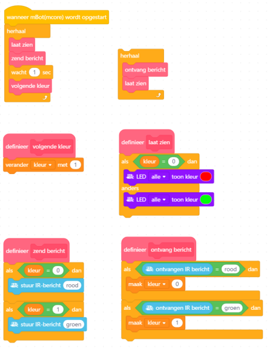
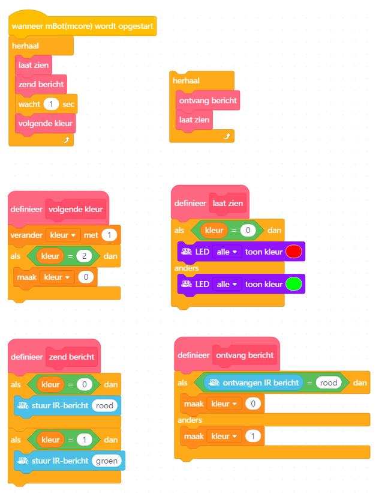

# Communicatie

## Code 1

Een leerlinge komt trots haar programma laten zien:

Je geeft haar een compliment over haar duidelijk
gestructureerde programma.

'Maar werkt het ook?', vraag je aan haar.
'Ik denk het wel!', zegt ze en ze 
zet op de eene mBot de linker 'herhaal' lus
en op een tweede mBot de rechter 'herhaal' lus.

Dan zien jullie dat:

 * Beide mBots worden rood
 * Beide mBots worden groen
 * Beide mBots blijven groen

Waar zit de fout?

## Code 2

Een leerling komt trots zijn programma laten zien:

Je geeft hem een compliment over zijn duidelijk
gestructureerde programma.

'Maar werkt het ook?', vraag je aan hem.
'Ik denk het wel!', zegt hij en hij 
zet op de eene mBot de linker 'herhaal' lus
en op een tweede mBot de rechter 'herhaal' lus.

Dan zien jullie dat:

 * Beide mBots worden rood
 * Beide mBots worden groen
 * De zendende mBot wordt rood, de ontvanger blijft groen
 * De zendende mBot wordt groen, de ontvanger blijft groen
 * De zendende mBot wordt rood, de ontvanger blijft groen
 * De zendende mBot wordt groen, de ontvanger blijft groen
 * Etcetera

Waar zit de fout?
