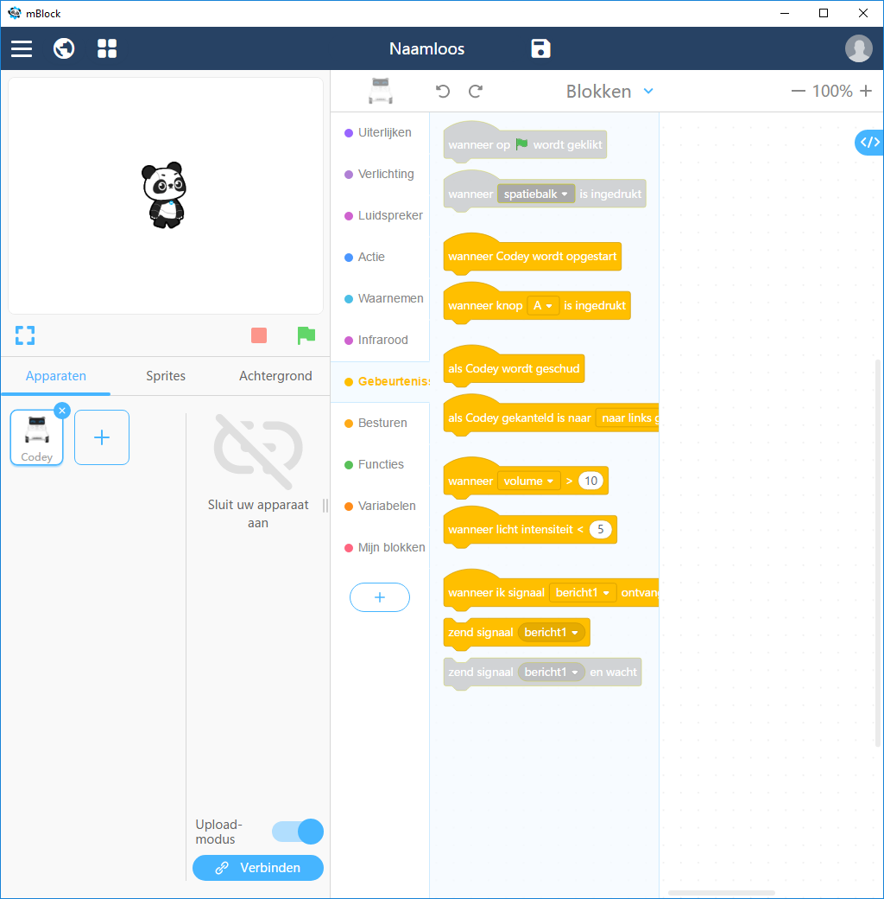
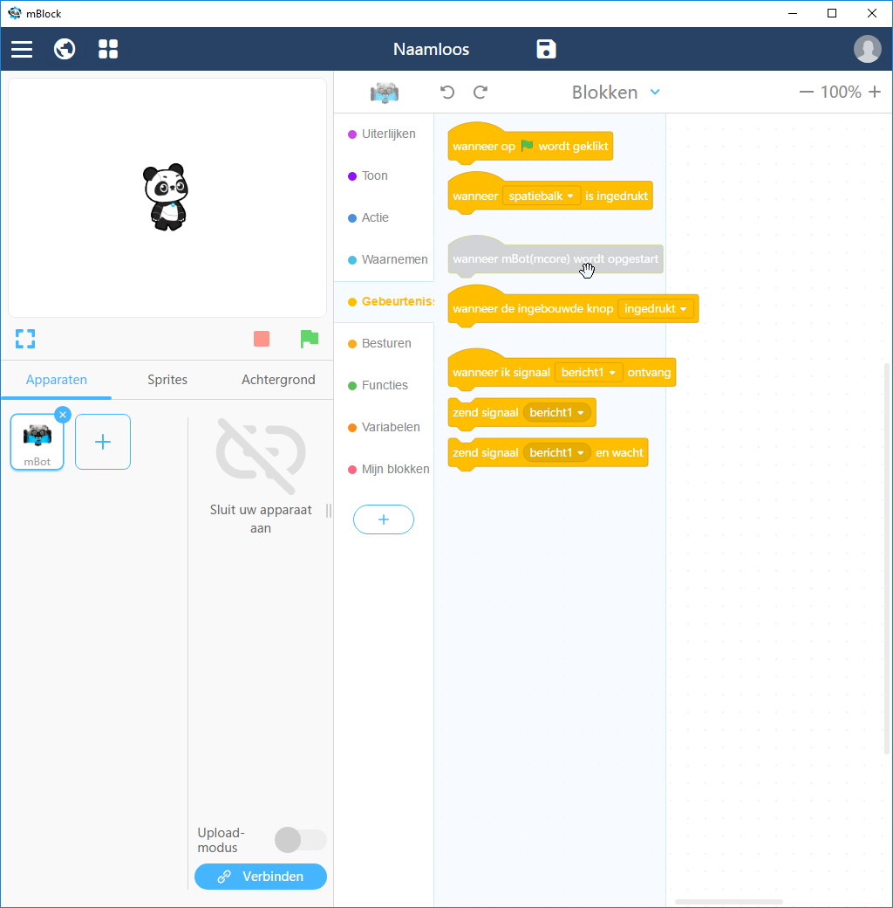
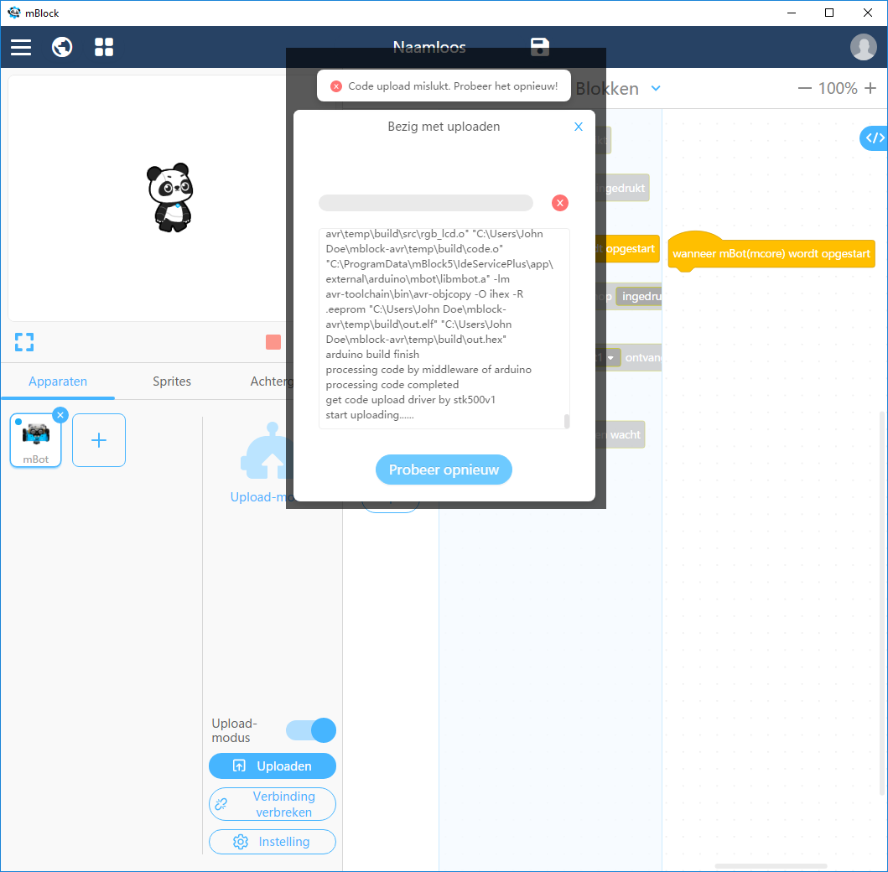

# Opstarten

## Kies een mBot als device (niet Codey) voor de juiste blokken

## Connect de mBot voor de juiste blokken

## Zet de mBot in de upload modus voor de juiste blokken

## Zet de mBot aan bij het uploaden

