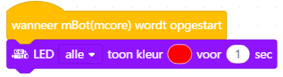
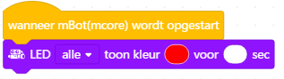
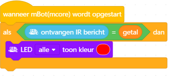
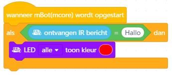

# Werkt dit?

Wat                            |Werkt
-------------------------------|-----
      |Ja
          |Ja
       |Nee
            |Ja
         |Nee
          |Ja
      |Ja
          |Ja
      |Ja
    |Nee
|Nee
       |Ja
   |Ja
