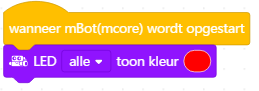
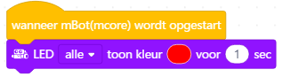
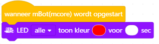
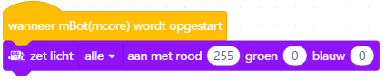
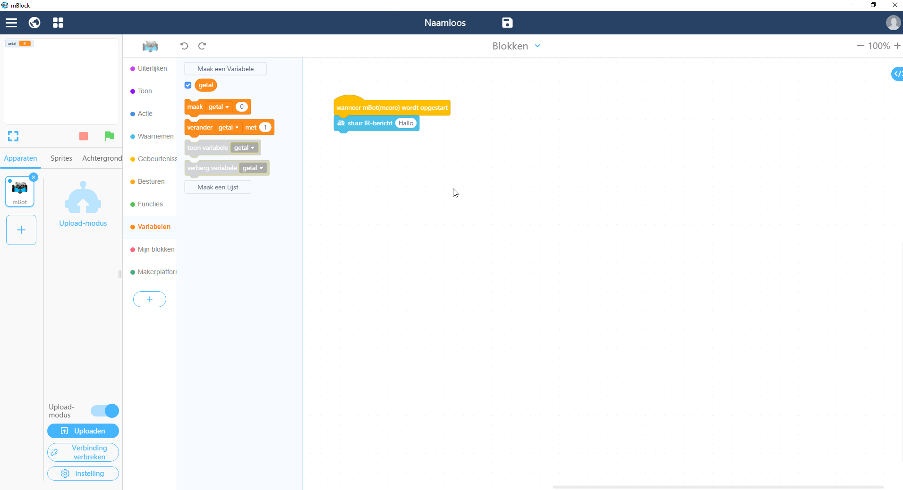
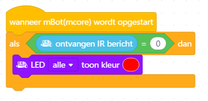
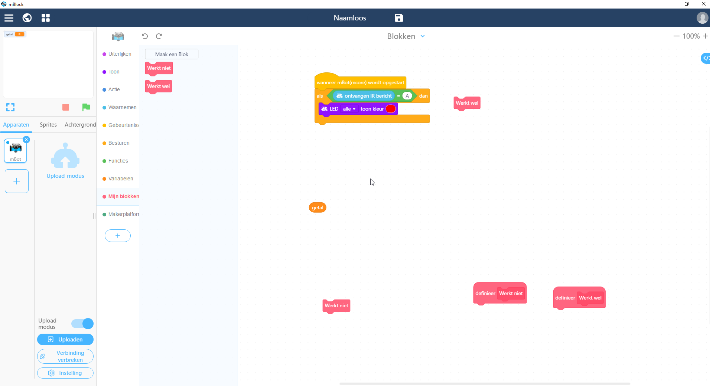
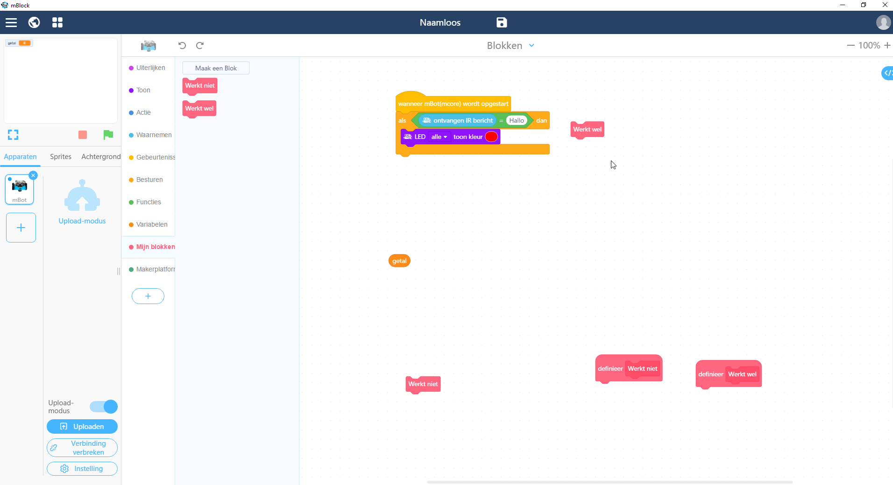

# Werkt dit?

Wat                            |Werkt
-------------------------------|-----
      |
          |
       |
            |
         |
          |
      | 
          | 
      | 
    |
|
       |
   |
